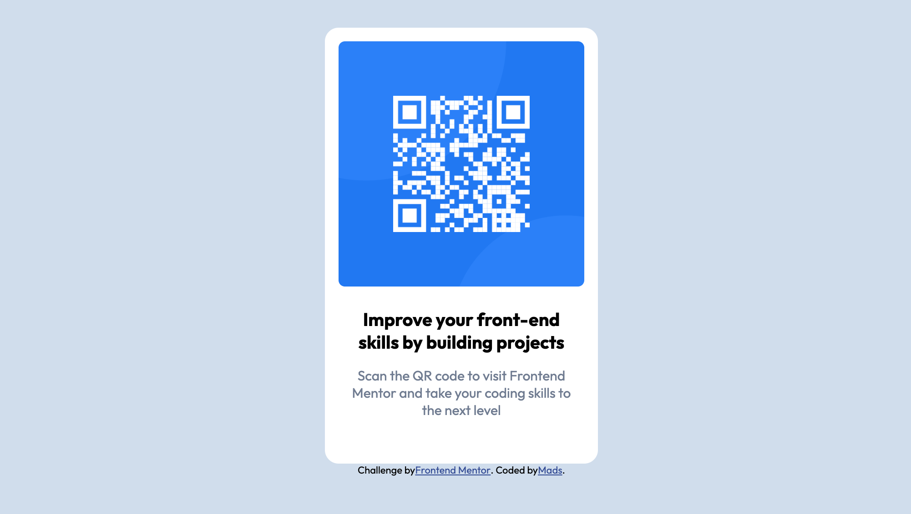

# Frontend Mentor - QR code component solution

This is a solution to the [QR code component challenge on Frontend Mentor](https://www.frontendmentor.io/challenges/qr-code-component-iux_sIO_H). Frontend Mentor challenges help you improve your coding skills by building realistic projects. 

## Table of contents

- [Overview](#overview)
  - [Screenshot](#screenshot)
  - [Links](#links)
- [My process](#my-process)

## Overview

### Screenshot

### Links

- Solution URL: [repository](https://github.com/MadsPB/MadsPB.github.io)
- Live Site URL: [Github page](https://madspb.github.io/)

## My process

I'm trying out frontendmentor.io while learning about css and html.
I used flexbox, and pretty much set the size of the QR-component container by eye meassure.

On to the next challenge!